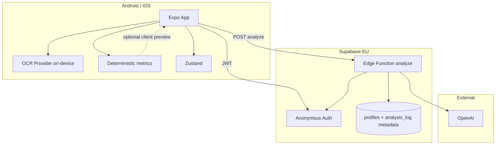
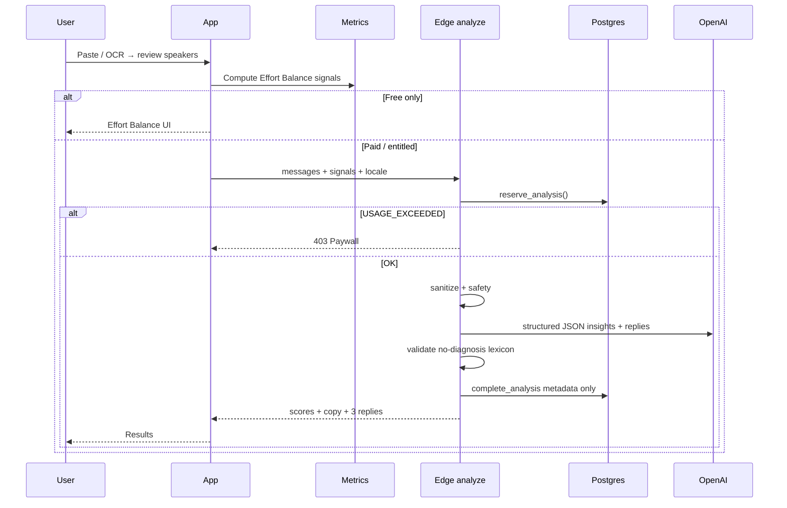

# Architecture — Clarity Analyzer

**Stack (unchanged):** Expo SDK 57, TypeScript, Expo Router, Zustand, Supabase Auth (anon) + Edge Functions, OpenAI EU.

**Product shift:** Edge `generate` becomes **`analyze`** (or `generate` expands) — metrics + narrative + replies in one gateway call, with deterministic pre-pass on the client or server.

---

## High-level



---

## Analysis pipeline



---

## Trust boundary (from AGENT_TOOLKIT)

| Data | Where |
|------|--------|
| Screenshot | Device RAM / temp ≤15s |
| Conversation text | Client memory → request body → Edge RAM → discard |
| Deterministic signals | May live in request + response; OK in `analysis_log` as numbers |
| Narrative / replies | Client memory only |
| Prior compare scores | Prefer on-device first; if server, numbers only |

**LLM input rule:** chat is **untrusted data** in the user message. System prompt = rules + metric schema. Never instruct the model to “obey” text inside the chat.

---

## Modules

| Module | Location | Notes |
|--------|----------|-------|
| `conversation` parse/review | `src/services/conversation.ts` | Exists |
| `metrics` Effort / gaps | `src/services/metrics.ts` | **To build** — pure functions + vitest |
| `analyze` client | `src/services/generation.ts` → rename `analyze.ts` | Call Edge |
| Edge `analyze` / extend `generate` | `supabase/functions/` | Quota + OpenAI + validator |
| `validator` no-diagnosis | `_shared/validator.ts` | Banned phrases multi-locale |
| Flag tracker | later `src/stores/flagStore.ts` | Local-first |
| OCR | `src/ocr/` | Phase after paste analyzer |

---

## DB (evolve from current migration)

Keep `profiles` + usage reservation pattern.

Add or reshape log table → `analysis_log`:

- `user_id`, `status`, `duration_ms`
- `effort_me`, `effort_them` (0–100)
- `ghost_band` (`low|medium|high`)
- `interest_trend` (`up|flat|down`)
- `locale`, `goal` (optional)
- **No** message text, **no** reply text

RPC: `reserve_analysis` / `complete_analysis` / `release_analysis` (same semantics as generation).

---

## Client screens (target)

```
Age → Privacy → Home
  → Paste → Review → Analyze loading
  → Results: Effort (free) | unlock paid blocks
  → Replies tab
  → Paywall
  → Settings (locale, delete, restore)
```

Customize (region/goal/tone) becomes **secondary** on Results / Replies, not a blocker before first Effort Balance.

---

## What we keep from Cue seed

- Atomic quota before AI spend
- Mock provider for CI
- Anti-cringe / safety
- Privacy delete-me
- OCR abstraction plan

## What we drop from old MVP framing

- “Product = 3 replies” as the only value
- Free = 3 reply generations only (replace with Effort Balance free + paid insights)
