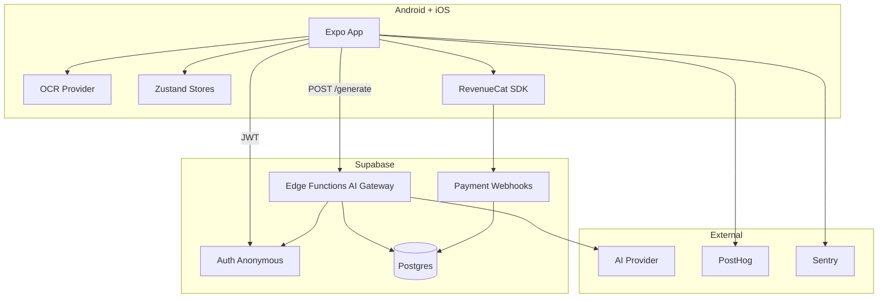
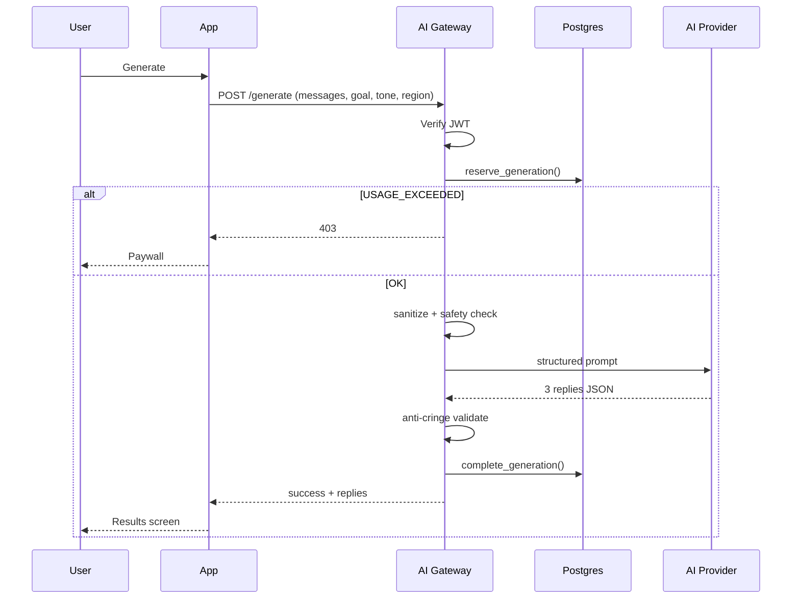

# 04 — Architecture

## High-level



## Генерация (sequence)



## OCR abstraction (кроссплатформа)

```
src/ocr/
  types.ts              # OCRResult, OCRBlock, OCRError
  OcrProvider.ts          # interface
  segmentation.ts       # platform-agnostic clustering (порт из cue-ocr)
  providers/
    mlkit.android.ts    # ML Kit Text Recognition
    vision.ios.ts       # Apple Vision (порт cue-ocr)
    mock.ts             # dev + tests
  index.ts              # getOcrProvider(): Platform.select
```

**Правило:** скриншот никогда не отправляется на backend. Только extracted text в памяти приложения.

## Client layers (как Cue, но с `components/`)

```
screens/     # UI only
components/  # Button, Card, ErrorState
services/    # API, auth, purchases, ocr, analytics
stores/      # zustand
hooks/       # usePrivacyGate, etc.
types/       # domain + api contracts
config/      # region profiles RU, env
```

## Backend modules (портировать из Cue)

| Модуль Cue | Действие |
|------------|----------|
| `generate/index.ts` | Порт + RU prompts |
| `validator.ts` | RU banned phrases |
| `safety.ts` | RU patterns |
| `sanitizer.ts` | Без изменений |
| `usage reservation RPC` | Без изменений |
| `revenuecat-webhook` | Без изменений |
| `migrate-account` | Опционально v1.5 |
| `cue-ocr` native module | Split → Android ML Kit + iOS Vision |

## Privacy boundary

| Данные | Где живут |
|--------|-----------|
| Скриншот | Только RAM + temp file ≤15s on device |
| Conversation text | Client memory + request body → server RAM → discard |
| Replies | Client memory only |
| Metadata (goal, tone, region, duration) | `generation_log` table |

## Что не тащить из Cue as-is

- iOS-only `eas.json` profiles без Android
- `EXPO_PUBLIC_REVENUECAT_IOS_API_KEY` only → добавить Android key
- English-only UI strings hardcoded → `i18n` с первого дня (хотя бы `ru.json`)
- Apple Sign In only → Google Sign In для Android users
